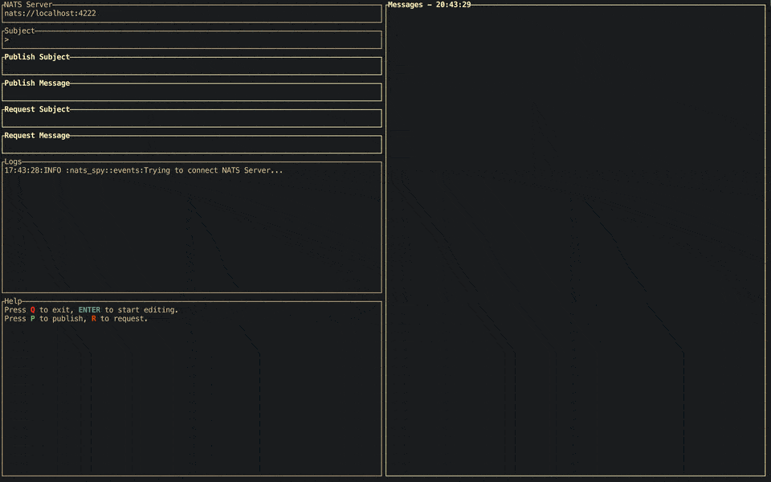

# nats-spy

nats-spy is a terminal tool to help you to monitor NATS messages.



# Install
- Homebrew (macOS)
```
brew install alihanyalcin/nats-spy/nats-spy
```

# Usage
```
USAGE:
    nats-spy [FLAGS] [OPTIONS]

FLAGS:
    -h, --help           Prints help information
    -u, --username       Authenticate with NATS using username.
    -p, --password       Authenticate with NATS using password.
    -t, --token          Authenticate with NATS using a token.
    -c, --credentials    Authenticate with NATS using a .creds file.
    -V, --version        Prints version information

OPTIONS:
    -n, --nats-url <nats-url>    NATS Server to establish a connection. [default: nats://localhost:4222]
    -s, --subject <subject>      Subscription subject for NATS connection. [default: >] 
```
